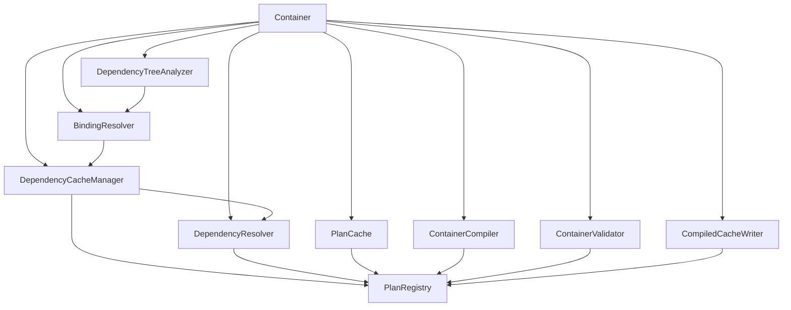

# Circular dependencies in `src/Container/` — assessment

Scope: cycles in **this library's own class graph**. Not the cycles the container
detects in *user* code — `CircularDependencyException`, `DependencyNode`'s cut
flag and `dependencyGraph()` are features, and nothing here touches them.

## Method

`madge` is a JavaScript tool and does not apply; `deptrac`/`phpat` are not in
`composer.json`. The graph below was built by tokenising every file under `src/`
with `token_get_all()`, resolving each name through the file's `use` statements
and namespace, and running Tarjan's algorithm over the result.

Edges are classified so that "who constructs whom" can be told apart from "whose
docblock mentions whom":

| kind | meaning |
|---|---|
| `new` / `ref` / `static` / `instanceof` / `extends` / `implements` | a real reference in code |
| `import-type` | `@psalm-import-type X from Y` |
| `doc` | a type named in a `@param`/`@return`/`@var` |

Prose in a docblock (`see Container::withSelfReference()`) is deliberately **not**
an edge — counting it invented four cycles that do not exist, which is worth
recording because it is the failure mode of the obvious grep-based approach.

Two graphs are reported: **runtime code edges only**, and **code + type edges**.
They answer different questions and only the first one can deadlock a loader.

Limits: string-literal class names are not followed (the only ones in `src/` are
inside CLI help text), and neither is anything resolved dynamically. For a
library with no service-locator string map, that is complete enough.

## The graph before

41 classes, 93 edges. Two strongly connected components.

### SCC 1 — the resolution core (runtime code edges)

```
{BindingResolver, Container, DependencyCacheManager, DependencyResolver, DependencyTreeAnalyzer}

  Container              -> BindingResolver          [ref,new]
  Container              -> DependencyCacheManager   [ref,new,static]
  Container              -> DependencyResolver       [static]      (resetStaticCaches only)
  Container              -> DependencyTreeAnalyzer   [ref,new]
  BindingResolver        -> DependencyCacheManager   [ref]
  DependencyTreeAnalyzer -> BindingResolver          [ref]
  DependencyCacheManager -> DependencyResolver       [ref,new]
  DependencyCacheManager -> Container                [ref]         <-- back edge
  DependencyResolver     -> Container                [ref]         <-- back edge
```

Everything except the two marked edges points **down**, from the container to the
collaborators it owns. The whole component existed because of those two.

### SCC 2 — the plan vocabulary (code + type edges)

Widening to type edges pulled five more classes in, all through one hub:

```
{BindingResolver, CompiledCacheWriter, Container, ContainerCompiler,
 ContainerValidator, DependencyCacheManager, DependencyResolver,
 DependencyTreeAnalyzer, PlanCache, PlanRegistry}
```

`DependencyResolver` declared `ParamPlan`, `PropPlan`, `MethodPlan`, `ClassPlan`,
`StoredClassPlan` and `CompiledPlans`. Seven classes imported from it — including
`PlanRegistry`, which `DependencyResolver` itself constructs.

### SCC 3 — the interface and its builder (type edges)

```
ContainerInterface       -> ContextualBindingBuilder [ref]          (when() returns it)
ContextualBindingBuilder -> ContainerInterface       [import-type]  (ContextualBindingsMap)
```

## Verdicts

| # | Cycle | Verdict |
|---|---|---|
| 1 | `DependencyResolver -> Container` | **Harmful, removed.** Accidental over-specification. |
| 2 | `DependencyCacheManager -> Container` | **Harmful, removed.** Same, one level up. |
| 3 | `PlanRegistry -> DependencyResolver` (and the 6-class fan-in behind it) | **Harmful, removed.** Type vocabulary on the wrong class. |
| 4 | `ContainerInterface <-> ContextualBindingBuilder` | **Deliberate and contained. Left alone.** |
| — | `Container` ↔ its collaborators via `WeakReference` | **Not a cycle. Do not touch.** |

### 1 & 2 — the concrete back-pointer to `Container`

`DependencyResolver::$parent` was typed `?Container` and asked exactly three
things of it: `provides()`, `get()`, `getBindings()`. All three are on
`ContainerInterface`. `DependencyCacheManager::$parent` was typed `?Container`
and did nothing with it at all except hand it to the resolver.

So the concrete typehint bought nothing and cost the two edges that closed the
core cycle. This is over-specification, not design: the value passed is still the
same `Container` object, and `createScope()` is the only caller of either
`inheritFrom()`.

Worth being precise about *why* this is worth fixing, because "cycles are bad" is
not an argument on its own:

- Both classes are `@internal`, but naming a `final` `@api` class from an
  implementation detail means neither can be read, tested or reasoned about
  without the 1600-line class in scope.
- It also meant the resolver could not be exercised against a test double even in
  principle, since `Container` is `final`.

Verdict: structural, harmful, cheap to remove, zero behaviour change.

### 3 — plan types declared on the resolver

`CompiledPlans` and its five supporting shapes describe **what a `PlanRegistry`
holds**. Declaring them on `DependencyResolver` — the class that *builds* plans —
gave the hottest and largest class in the library a docblock fan-in of 7 and made
the 39-line data holder point back at its own constructor.

Moving the vocabulary to `PlanRegistry` reverses every one of those edges to run
downhill: `DependencyResolver -> PlanRegistry` was already a code edge.

Verdict: harmful in the "hard to reason about" sense specifically — the type a
compiled-cache file is written from lived in the resolver, so `CompiledCacheWriter`
had to reach past the class that owns the data. Docblock-only change, no runtime
effect whatsoever.

### 4 — `ContainerInterface` and `ContextualBindingBuilder`

Left as is, on purpose. `when()` returns the builder, so the interface must name
it; the builder needs the `ContextualBindingsMap` shape, and `ContainerInterface`
is where the container's whole type vocabulary lives (`Binding`, `BindingsMap`,
`ContextualBindingsMap`, `StatsArray`). Both are `@api`.

The cycle is real but exists only in psalm's type graph. The builder holds no
container — a by-reference array and an optional `Closure`, nothing else — so
there is no runtime coupling to break. Fixing it would mean inventing a class
whose only job is to hold one type alias, which trades a harmless cycle for a
worse structure. **Deliberate and contained.**

### The `WeakReference` back-pointers are the fix, not the problem

`Container::$selfReference`, `DependencyResolver::$containerRef`,
`DependencyCacheManager::$containerRef`, `BindingResolver::$containerRef` and
`Container::$scopes` are all weak, and `FactoryManager` / `DependencyResolver`
use `WeakMap` for closure-keyed state. That is issue #149's fix: a strong
back-pointer made every container a reference cycle, so dropping one released it
whenever the GC next ran instead of immediately — which matters for the documented
"a scope is a request lifetime" behaviour under `gc_disable()`.

None of these are edges in the class graph at all: they are typed `WeakReference`,
not `Container`. Converting any of them to a strong reference would reintroduce the
leak. **Do not simplify.**

Note also that the *object-lifetime* graph is separately acyclic and was already
right: a scope holds its parent strongly, the parent holds its scopes weakly. The
strong direction points at the longer-lived object, which is the correct way round.

## What changed

Three edits, all in `src/Container/`. No behaviour change; no `@api` signature
change.

1. **`PlanRegistry`** now declares `ParamPlan`, `PropPlan`, `MethodPlan`,
   `ClassPlan`, `StoredClassPlan`, `CompiledPlans`. `DependencyResolver`,
   `DependencyCacheManager`, `Container`, `ContainerCompiler`,
   `ContainerValidator`, `CompiledCacheWriter` and `PlanCache` import from it.
2. **`DependencyResolver::inheritFrom()`** and `$parent`: `Container` →
   `ContainerInterface`.
3. **`DependencyCacheManager::inheritFrom()`** and `$parent`: `Container` →
   `ContainerInterface`.

Both `inheritFrom()` methods are on `@internal` classes, and widening a parameter
type cannot break a caller in any case.

## The graph after



- **Runtime code edges: no cycles.**
- **Code + type edges: one cycle**, `ContainerInterface <-> ContextualBindingBuilder`,
  by the decision above.

Fan-in of the two classes that were the hubs:

| class | before | after |
|---|---|---|
| `DependencyResolver` | 7 | 2 |
| `Container` | 3 | 1 (`Console\CliConfig`, which builds one) |
| `PlanRegistry` | 3 | 7 |

`PlanRegistry` absorbing the fan-in is the point: it is a 39-line leaf with no
outgoing edges, so nothing it holds can point back.

## What was deliberately not done

**`Container` was not split.** Its fan-out is 25, by far the largest in the
library, and that is the real coupling fact about this codebase — but it is
*fan-out*, not a cycle, and it is what a facade over eleven collaborators looks
like. Splitting it would change `@api` surface for an architectural score.

**`DependencyResolver` was not split.** `docs/performance.md` already records
this: separating its cold surface is worth about 1%, "at the edge of what the
harness can resolve, in exchange for restructuring the most safety-critical class
in the library". That judgement stands and is not a cycle question.

**Nothing on the hot path was restructured.** The two typehint widenings touch a
property assigned once per `createScope()`; the rest is docblocks. Measured with
`composer bench:compare -- HEAD` (warm-up discarded, alternating, as
`docs/performance.md` requires):

| subject | before | after | delta |
|---|---|---|---|
| `benchCreateScope` | 0.871μs | 0.843μs | −3.2% |
| `benchResolveDeepChain` | 0.878μs | 0.888μs | +1.1% |
| `benchResolveDeepChainWarmedUp` | 0.877μs | 0.853μs | −2.7% |
| `benchColdResolveDeepChain` | 5.335μs | 5.322μs | −0.2% |
| `benchColdResolveDeepChainCompiled` | 3.324μs | 3.290μs | −1.0% |

All within noise, in both directions. No assertion failed.

**No CHANGELOG entry.** Nothing observable changed, and every class involved is
either `@internal` or unchanged in signature.

## Proposal: a cycle gate

`gacela-project/gacela` gates this in CI — `.github/workflows/module-cycles.yml`
runs `bin/gacela debug:graph --check --allowed-cycles=allowed-module-cycles.json`,
where the allow-list is self-invalidating: an entry that no longer matches a real
cycle fails just as loudly as an undeclared one, so it stays a record instead of
becoming a mute button.

The equivalent here is smaller, because this library has no modules — the unit is
the class, and the analysis is ~150 lines of `token_get_all()` plus Tarjan. It is
**worth adding**, for one reason: the two edges removed above were each a single
word in a typehint. Nothing in the toolchain would have objected to either, and
nothing would object to the next one.

Suggested shape, deliberately not implemented here to keep this change reviewable:

- `tools/class-cycles.php` — builds the graph, prints SCCs, exits non-zero on any
  cycle not listed in `allowed-class-cycles.json`.
- Seed the allow-list with the one entry above:
  `ContainerInterface <-> ContextualBindingBuilder`, with the reason in the file.
- Run it from the existing `ci.yml` rather than a new workflow — this repo runs
  one CI file, unlike the sibling.
- Gate on the **runtime code graph**, and report the type graph without failing.
  Type-level cycles are worth seeing and not worth blocking a release for.

## Related

- `docs/backward-compatibility.md` — what `@api` covers
- `docs/performance.md` — the benchmark protocol used above
- Issue #149 — why the back-pointers are weak
